<picture>
  <source media="(prefers-color-scheme: dark)" srcset="assets/hero-dark.svg">
  
</picture>

  <a href="https://hugodelacour.com"><picture><source media="(prefers-color-scheme: dark)" srcset="assets/link-portfolio-dark.svg"></picture></a>
  &nbsp;
  <a href="https://linkedin.com/in/hugo-delacour"><picture><source media="(prefers-color-scheme: dark)" srcset="assets/link-linkedin-dark.svg"></picture></a>
  &nbsp;
  <a href="mailto:hugodelacour.pro@gmail.com"><picture><source media="(prefers-color-scheme: dark)" srcset="assets/link-email-dark.svg"></picture></a>

 

<picture>
  <source media="(prefers-color-scheme: dark)" srcset="assets/stack-dark.svg">
  
</picture>

 

<picture>
  <source media="(prefers-color-scheme: dark)" srcset="https://raw.githubusercontent.com/M-U-C-K-A/M-U-C-K-A/output/activity-dark.svg">
  
</picture>

 

<i>“Good design is as little design as possible.”</i> — Dieter Rams

